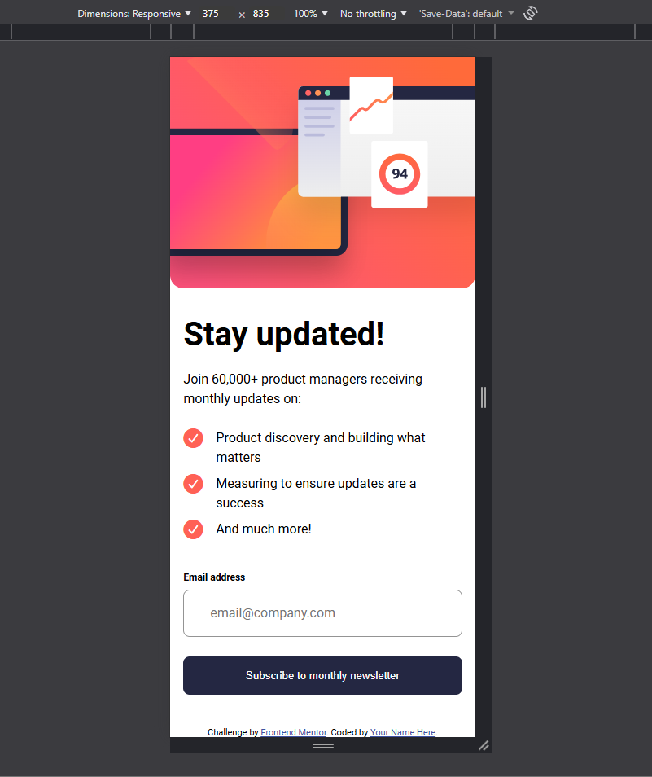
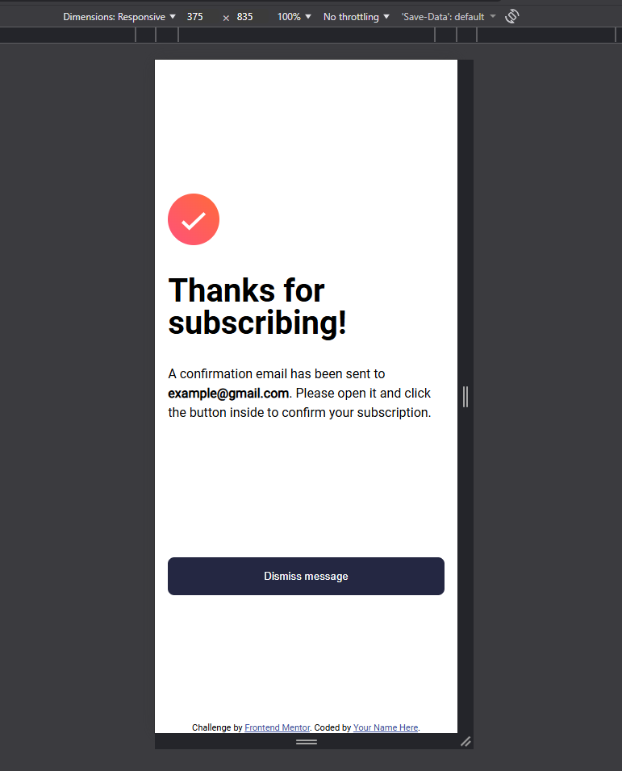
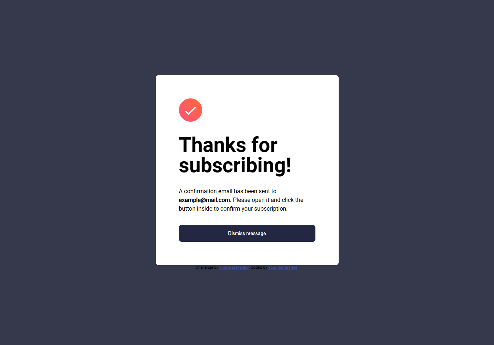
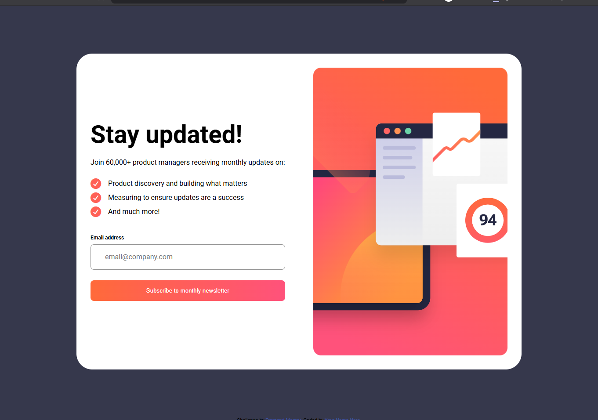
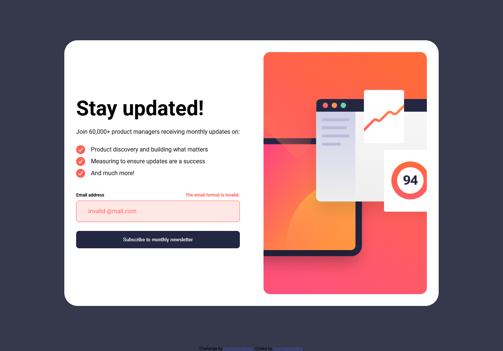

# Frontend Mentor - Newsletter sign-up form with success message

## Table of contents

- [Frontend Mentor - Newsletter sign-up form with success message](#frontend-mentor---newsletter-sign-up-form-with-success-message)
  - [Table of contents](#table-of-contents)
  - [Overview](#overview)
    - [The challenge](#the-challenge)
    - [Screenshots](#screenshots)
    - [Links](#links)
  - [My process](#my-process)
    - [Built with](#built-with)
    - [AI Collaboration](#ai-collaboration)
  - [Author](#author)

## Overview

### The challenge

Users should be able to:

- Add their email and submit the form
- See a success message with their email after successfully submitting the form
- See form validation messages if:
  - The field is left empty
  - The email address is not formatted correctly
- View the optimal layout for the interface depending on their device's screen size
- See hover and focus states for all interactive elements on the page

### Screenshots

| Mobile                                        | Tablet                                         | Desktop                                        |
| :-------------------------------------------- | :--------------------------------------------- | :--------------------------------------------- |
|  |  |  |

| Mobile - Confirmation                                      | Desktop/Tablet - Confirmation                                |
| :--------------------------------------------------------- | :----------------------------------------------------------- |
|  |  |

| Hover                                                | Error Handling                                        |
| :--------------------------------------------------- | :---------------------------------------------------- |
|  |  |

### Links

- Solution URL: [here](https://github.com/JNedelinov/newsletter-sign-up)
- Live Site URL: [here](https://jnedelinov-newsletter-sign-up.netlify.app/)
- 
## My process

### Built with

- Semantic HTML5 markup
- Mobile-first workflow
- Vanilla JS
- Less.js
- Flexbox
- CSS Grid
- 
### AI Collaboration

I prompted the AI to guide me in refactoring a single, monolithic stylesheet into a modular CSS architecture.

## Author

- GitHub - [@JNedelinov](https://github.com/JNedelinov)
- Frontend Mentor - [@JNedelinov](https://www.frontendmentor.io/profile/JNedelinov)
- LinkedIn - [@Zhulien Zhivkov](https://www.linkedin.com/in/zhulien-zhivkov-493889119/)